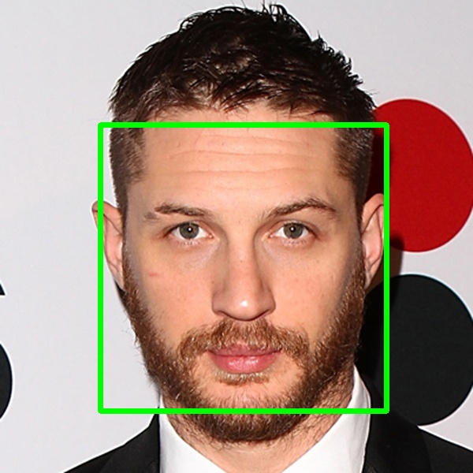
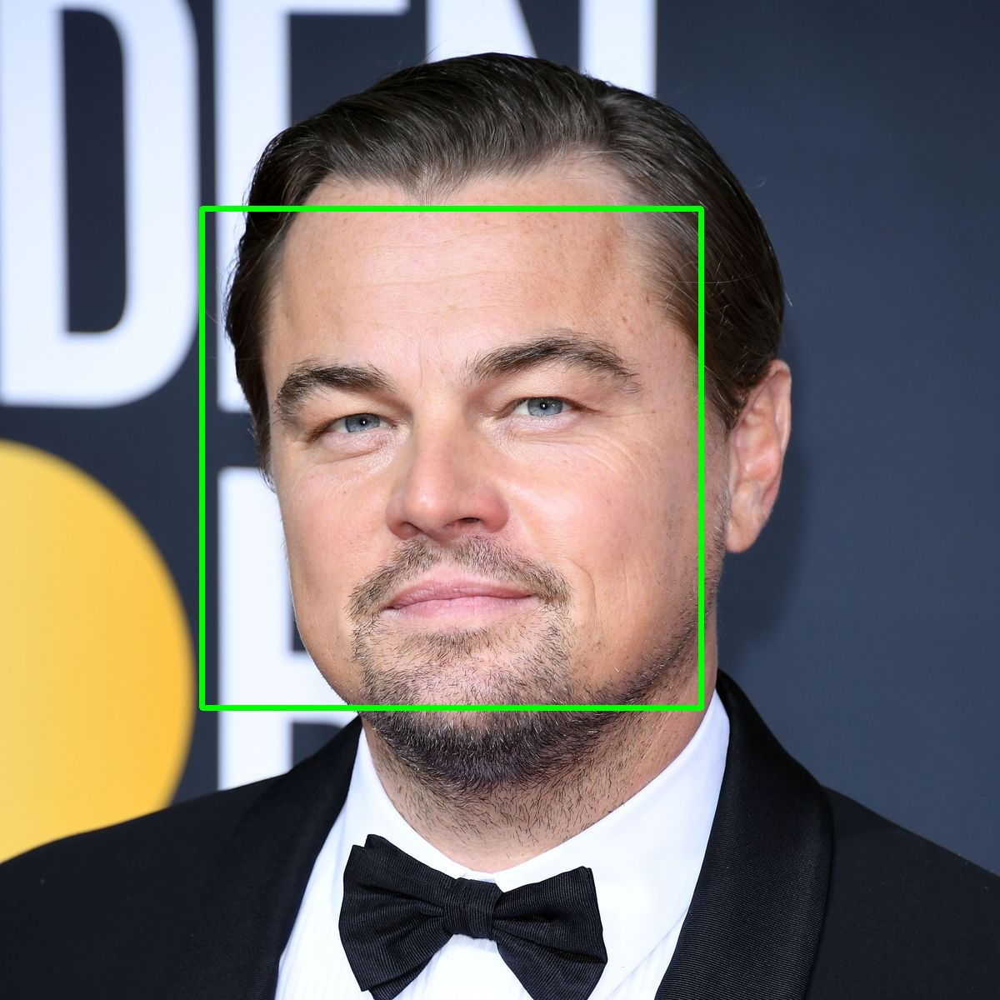
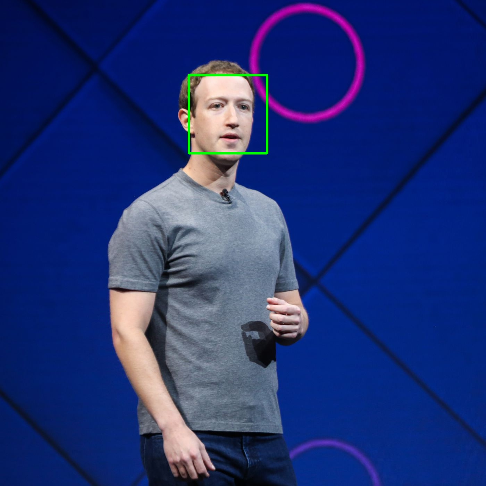
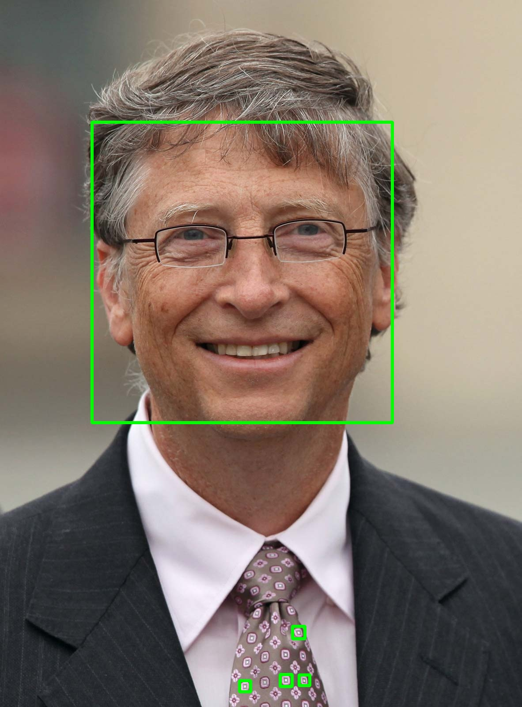

# Face-Detector

## For images
1. Put the images in the **input_data** folder.
2. Run **for_images.py**
3. The program will detect the faces and write the images in the **output** folder

## Samples

